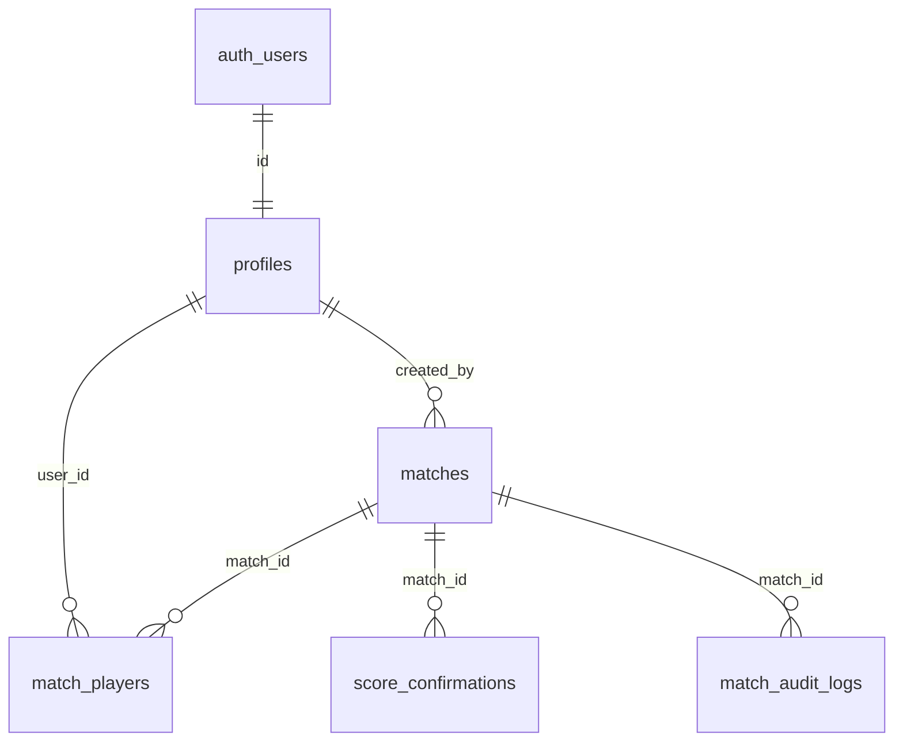

# 시스템 구조 및 설계

## 1. 전체 구조

```text
┌─────────────────────────────┐
│  GitHub Pages (정적 SPA)     │
│  React + TS + Vite          │
│  HashRouter (#/...)         │
└──────────────┬──────────────┘
               │  HTTPS (publishable key + 사용자 JWT)
┌──────────────▼──────────────┐
│  Supabase                   │
│  ├─ Auth      : 이메일 인증  │
│  ├─ PostgreSQL: 데이터       │
│  │   ├─ RLS   : 조회 권한    │
│  │   ├─ RPC   : 모든 쓰기    │
│  │   └─ Trigger: 프로필 생성 │
│  └─ Realtime  : 경기 실시간  │
└─────────────────────────────┘
```

- 서버 코드가 없는 순수 정적 SPA이므로 GitHub Pages에서 호스팅 가능.
- **쓰기는 전부 SECURITY DEFINER RPC**를 통해서만 수행. 테이블 직접 INSERT/UPDATE/DELETE는 RLS로 차단하여, 브라우저에서 API를 직접 호출해도 상태를 임의로 `confirmed`로 바꾸거나 확정 경기를 수정할 수 없다.
- 역할 검사는 `auth.uid()` 기반으로 DB의 `profiles.role`을 조회하는 `get_my_role()` 함수가 수행 (클라이언트 전달 값 불신).

## 2. ERD



| 테이블 | 용도 | 핵심 제약 |
|---|---|---|
| `profiles` | 이름·입상 구분·역할·활성 여부 | 가입 트리거로 자동 생성, role/is_active 변경은 트리거가 차단 |
| `matches` | 경기 날짜·상태·스코어·확정 정보·version | 상태 Enum, 확정 시 점수 필수 CHECK |
| `match_players` | 참가자 편성 (A1/A2/B1/B2) | `UNIQUE(match_id, position)`, `UNIQUE(match_id, user_id)` |
| `score_confirmations` | 팀별 스코어 확인 기록 | `UNIQUE(match_id, user_id)` |
| `match_audit_logs` | 수정 이력 (사유 포함) | 관리자만 조회 |
| `app_settings` | 운영 설정 (key-jsonb) | 관리자만 변경 |

## 3. 경기 상태 흐름

```text
open ──(4명 편성, 트리거 자동)──▶ ready ──(경기 시작)──▶ in_progress
  ▲                                │                        │
  └──(참가자 이탈, 트리거 자동)────┘                        │
                                   └──────┬─────────────────┘
                                          ▼ submit_score (참가자/관리자)
                                      submitted ◀─┐ (재제출 시 확인 기록 리셋)
                                          │       │
                                          ▼ confirm_score (상대 팀 참가자)
                                      confirmed ──▶ 관리자만 수정 가능 (사유 필수)
        어느 상태에서든 cancel_match ──▶ canceled (집계 제외)
```

- 확정 방식은 `app_settings.confirm_mode`로 전환: `double`(기본, 상대 팀 확인 필요) / `single`(제출 즉시 확정).
- 동시성 제어: `matches.version` 낙관적 잠금(불일치 시 한글 오류 반환) + `match_players` UNIQUE 제약(동시 슬롯 등록 차단) + RPC 내부 `SELECT ... FOR UPDATE`.

## 4. RLS 권한표

| 테이블 | SELECT | INSERT | UPDATE | DELETE |
|---|---|---|---|---|
| profiles | 로그인 사용자 | 가입 트리거만 | 본인(이름·입상만) / 관리자 RPC | 불가 |
| matches | 로그인 사용자 | RPC만 | RPC만 | 불가 |
| match_players | 로그인 사용자 | RPC만 | RPC만 | RPC만 |
| score_confirmations | 로그인 사용자 | RPC만 | 불가 | RPC만 |
| match_audit_logs | 관리자·서브 관리자 | RPC 내부 기록 | 불가 | 불가 |
| app_settings | 로그인 사용자 | 관리자 | 관리자 | 불가 |

## 5. RPC 함수 권한 매트릭스

| 함수 | 일반 사용자 | 서브 관리자 | 관리자 |
|---|---|---|---|
| `create_match` | ✅ (본인 A1 자동) | ✅ | ✅ |
| `register_player` | ✅ 빈 슬롯만 (대리 등록은 설정에 따름) | ✅ | ✅ |
| `remove_player` | 본인/본인 등록 슬롯, 스코어 제출 전 | ✅ 항상 | ✅ 항상 |
| `start_match` | 참가자만 | ✅ | ✅ |
| `submit_score` | 참가자만, 확정 전 | ✅ 모든 경기 | ✅ 모든 경기 |
| `confirm_score` | 상대 팀 참가자만 | (참가자일 때) | (참가자일 때) |
| `cancel_match` | 생성자, 스코어 제출 전 | ✅ 항상 | ✅ 항상 |
| `admin_set_player` | ❌ | ✅ | ✅ |
| `admin_update_score` | ❌ | ✅ 사유 필수 | ✅ 사유 필수 |
| `admin_reset_match` | ❌ | ✅ 사유 필수 | ✅ 사유 필수 |
| `admin_update_user` (활성) | ❌ | ✅ | ✅ |
| `admin_update_user` (역할) | ❌ | ❌ | ✅ (본인 제외) |
| `app_settings` 변경 | ❌ | ❌ (조회만) | ✅ |

## 6. 통계 계산 방식

- **확정(confirmed) 경기만** 집계에 포함. 취소·미확정 경기는 제외 (DB `get_player_stats`가 보장).
- 승률 = 승 ÷ 확정 경기 수 × 100 (0경기면 0%).
- 참가율 = 참가 일수 ÷ 기간 내 확정 경기가 개최된 날짜 수 × 100 (같은 날 여러 경기는 1일).
- 집계는 DB에서 수행(`get_player_stats`, `get_partner_stats`, `get_player_monthly_trend`, `get_player_recent_matches`)하여 전체 경기 데이터를 프런트로 내려받지 않는다.
- **순위 부여만 프런트**(`src/utils/ranking.ts`)에서 수행: 승수 → 승률 → 득실차 → 득점 → 경기수 → 이름 순 비교, 공동 순위 허용 경쟁 순위(1, 2, 2, 4위). 기준 변경 시 이 파일만 수정하면 된다.
- 기간 계산(`src/utils/period.ts`): 주간 = 월~일, 분기 = 1~3/4~6/7~9/10~12월, 연간 = 1/1~12/31, 누적 = 전체.
- 날짜는 항상 한국 시간(`Asia/Seoul`) 기준(`src/utils/kst.ts` — `Intl.DateTimeFormat` 사용, 브라우저 시간대 무관).

## 7. Realtime 설계

- `matches`(날짜 필터), `match_players`(전체) 변경을 구독.
- 이벤트 수신 시 전체 목록을 다시 불러오지 않고 **변경된 경기 1건만 재조회**하여 목록에 반영 (`src/hooks/useMatchesByDate.ts`).
- 재연결(SUBSCRIBED 재진입) 및 온라인 복귀 시 목록을 1회 새로고침하여 끊긴 동안의 변경을 복구.
