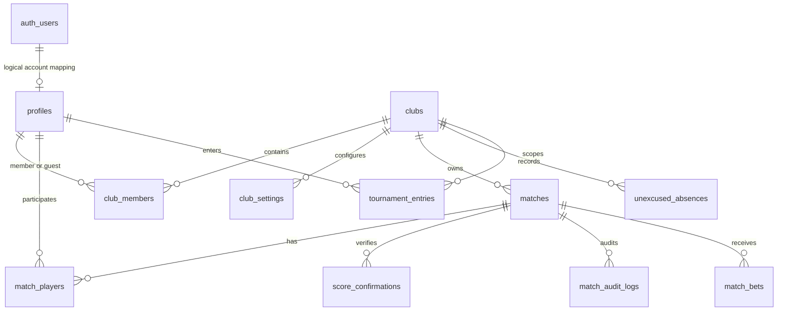

# 현재 플랫폼 분석

## 1. 분석 범위와 전제

- 분석 기준: `main` 브랜치, 커밋 `d5b9746`.
- 확인 범위: 저장소 전체 파일 목록, `README.md`, `package.json`, 환경설정, `.github/workflows/deploy.yml`, `src/`의 화면·서비스·상태·유틸리티, `supabase/migrations/01_schema.sql`부터 `37_club_fine_flag.sql`까지.
- 저장소에는 `AGENTS.md`가 없다.
- 이 문서의 DB 구조는 01~37 migration을 순서대로 적용했을 때의 **의도된 최종 구조**다. 라이브 Supabase의 migration 적용 이력이나 실제 catalog를 직접 조회하지 못했으므로 운영 DB와 완전히 같다는 보장은 없다. 구현 전에는 `pg_catalog`, `pg_policies`, 함수 권한(`proacl`)과 migration 적용 이력을 운영 DB에서 대조해야 한다.
- 비밀키와 개인정보의 실제 값은 확인하거나 기록하지 않았다. 저장소에서 추적되는 환경 파일은 예시값만 있는 `.env.example`이며, 클라이언트 코드는 publishable/anon key만 사용한다.
- 애플리케이션 코드와 SQL은 수정하지 않았다.

## 2. 핵심 평가

현재 구조에는 글로벌 레이팅의 출발점이 될 만한 요소가 있다.

- 로그인 회원의 `profiles.id`는 클럽별 ID가 아니라 플랫폼 전역 ID다.
- `club_members(club_id, user_id)`로 한 회원의 다중 클럽 가입을 표현한다.
- `matches`와 `match_players`에 확정 경기의 양 팀 점수, 단식/복식 유형, 참가자별 UUID와 포지션이 남는다.
- 제출·확인·확정 흐름, 일부 감사 로그, 클럽별 조회 범위가 존재한다.

하지만 이 상태로 글로벌 레이팅을 운영 데이터에 바로 적용하면 안 된다. 가장 큰 이유는 다음과 같다.

1. `profiles`가 로그인 계정, 게스트, 선수 실체를 동시에 표현하며 별도의 글로벌 선수 식별자가 없다.
2. 게스트의 회원 전환이 같은 클럽의 **이름 중심 자동 병합**이며, 병합·분리 이력과 검수 절차가 없다.
3. 경기 결과는 세트별 원본이 아니라 양 팀의 단일 합산 점수만 저장한다.
4. 경기 출처, 원문, 검수, 신뢰도, 중복 탐지 구조가 없다.
5. 저장형 레이팅, 모델 버전, deviation/volatility, 계산 실행 및 변경 이력이 없다.
6. 일부 RLS/RPC 권한 경계에는 즉시 점검해야 할 심각한 문제가 있다.

따라서 우선 목표는 알고리즘 구현이 아니라 **안전한 선수 식별, 원천 경기 보존, 출처·검수·중복 관리, 재현 가능한 레이팅 입력 구조**다.

## 3. 사용 기술

| 영역 | 현재 기술 | 근거 |
|---|---|---|
| 프런트엔드 | React 19, TypeScript, Vite 8 | `package.json`, `src/main.tsx` |
| 라우팅 | React Router 7 `HashRouter` | `src/App.tsx` |
| 스타일 | Tailwind CSS 4, 반응형 SPA | `package.json`, `src/index.css`, `vite.config.ts` |
| 상태 관리 | Zustand 5 | `src/stores/*` |
| 날짜 처리 | date-fns 4, KST 유틸리티 | `package.json`, `src/utils/kst.ts`, `src/utils/period.ts` |
| 백엔드 | Supabase PostgreSQL, Auth, Realtime, RLS, RPC | `src/lib/supabase.ts`, `supabase/migrations/*` |
| 배포 | GitHub Pages, GitHub Actions | `.github/workflows/deploy.yml` |
| 외부 API | YouTube Data API v3를 브라우저에서 호출 | `src/services/youtubeService.ts` |
| 테스트/품질 도구 | TypeScript 빌드 스크립트만 존재; 자동 테스트·lint 스크립트 없음 | `package.json` |

`src/lib/supabase.ts`는 `VITE_SUPABASE_URL`과 `VITE_SUPABASE_PUBLISHABLE_KEY`만 사용한다. `service_role` 키를 클라이언트에서 사용하는 코드는 발견하지 못했다. `VITE_YOUTUBE_API_KEY`는 브라우저 번들에 들어가므로 비밀로 취급할 수 없고, `docs/deployment.md`도 API/HTTP referrer 제한을 권고한다.

## 4. 애플리케이션 구조와 주요 화면

### 4.1 URL 구조

`src/App.tsx`는 GitHub Pages 호환을 위해 `HashRouter`를 사용한다.

| URL | 화면 | 접근 조건 |
|---|---|---|
| `#/login` | 이메일 로그인 | 비로그인 |
| `#/signup`, `#/c/:clubSlug/signup` | 클럽 선택 또는 지정 회원가입 | 비로그인 |
| `#/reset-password`, `#/update-password` | 비밀번호 재설정 | 링크/세션 상태에 따름 |
| `#/` | 내 클럽 선택·추가 가입 신청 | 로그인 |
| `#/platform` | 플랫폼 클럽 관리 | UI상 `is_platform_admin` |
| `#/c/:clubSlug` | 날짜별 경기, 결석, 추첨, YouTube 연결 | 해당 클럽 활성 회원 또는 플랫폼 관리자 |
| `#/c/:clubSlug/results` | 기간·단식/복식별 순위와 벌금 | 해당 클럽 활성 회원 |
| `#/c/:clubSlug/players/:userId` | 선수 상세 기록 | 해당 클럽 활성 회원 |
| `#/c/:clubSlug/admin` | 사용자·경기·대회·이력·내보내기·설정 | UI상 클럽 admin/sub_admin 또는 플랫폼 관리자 |
| `#/c/:clubSlug/settings` | 내 정보·비밀번호 변경 | 로그인·클럽 진입 |

기존 공유/진입 호환성의 핵심은 `#/c/{slug}`와 `#/c/{slug}/players/{userId}`다. 향후 글로벌 선수 화면을 추가하더라도 이 경로의 의미와 기존 `userId` 링크는 유지해야 한다.

### 4.2 주요 기능

- `MatchesPage`: 날짜별 경기 목록, 경기 생성, 참가자 등록, 복식 추첨 편성, 표시 순서 변경, 무단결석, YouTube 자동 매칭.
- `ResultsPage`: 단식/복식 및 기간별 승수·승률·득실·참가율 순위, 패자 벌금.
- `PlayerDetailPage`: 누적 성적, 추첨용 개인점수, 자주 함께한 파트너, 상대별 승률, 최근 경기, 월별 추이, 배팅, 대회 참가 기록.
- `AdminPage`: 사용자, 경기, 대회, 감사 이력, CSV 내보내기, 클럽 운영 설정.
- `PlatformAdminPage`: 클럽 생성, 이름·기능 플래그 수정, 클럽 삭제.
- `ClubSelectPage`: 여러 클럽 멤버십 목록과 추가 가입 신청.

## 5. 현재 DB 테이블과 관계

### 5.1 관계 개요

`auth.users`와 비게스트 `profiles`는 같은 UUID를 쓰지만, 게스트 지원을 위해 DB FK는 제거되어 있다. 따라서 이는 물리적 FK가 아니라 애플리케이션 규약이다.

### 5.2 테이블별 현재 역할

| 테이블 | 핵심 컬럼·관계 | 현재 역할과 제한 |
|---|---|---|
| `profiles` | `id`, `name`, `award_level`, `role`, `is_active`, `is_guest`, `affiliation`, `is_platform_admin` | 플랫폼 전역 프로필이지만 계정·선수·게스트 실체가 혼합됨. `role`은 migration 20 이후 레거시이며 클럽 권한 소스가 아님. |
| `clubs` | `id`, `name`, `slug`, `youtube_enabled`, `absence_enabled`, `fine_enabled` | 클럽과 URL slug. |
| `club_members` | PK `(club_id, user_id)`, `role`, `status` | 프로필과 클럽의 다대다 소속. `status`: pending/active/rejected. |
| `club_settings` | PK `(club_id, key)`, JSONB `value` | 클럽별 운영 설정. |
| `app_settings` | `key`, JSONB `value` | 레거시/신규 클럽 템플릿 및 일부 RPC의 글로벌 fallback. |
| `matches` | `club_id`, `match_date`, `match_type`, `status`, 양 팀 점수, 제출·확정자/시각, `version`, YouTube 필드, 배팅 필드, 표시 순서 | 경기 현재 상태와 단일 합산 점수를 한 행에 저장. 소유 클럽은 하나뿐. |
| `match_players` | `match_id`, `user_id`, `position` A1/A2/B1/B2, `registered_by` | 단식은 A1/B1, 복식은 4명을 개별 UUID로 표현. 명시적 team 테이블은 없음. |
| `score_confirmations` | `match_id`, `user_id`, `team`, `confirmed_at` | 제출자 팀과 상대 팀 확인 기록. |
| `match_audit_logs` | `before_data`, `after_data`, `changed_by`, `reason` | 제출·확정·관리자 정정·초기화·취소·관리자 편성 변경 일부를 기록. 경기 삭제 시 cascade 삭제됨. |
| `unexcused_absences` | `club_id`, `absence_date`, `user_id`, `registered_by` | 클럽·날짜별 무단결석. |
| `match_bets` | `match_id`, `club_id`, `user_id`, 금액·예측·정산 결과 | 가상 배팅 기록. |
| `tournament_entries` | `club_id`, `user_id`, 월, 대회명, placement, 최대 참가자, notes | 독립된 대회 엔터티 없이 선수별 외부 대회 참가 사실만 저장. |

### 5.3 현재 존재하지 않는 핵심 구조

- 글로벌 선수 엔터티 또는 `profiles`와 분리된 선수 ID.
- 선수 별칭·외부 ID·병합/분리·클레임 이력.
- 클럽 간 경기와 참가 클럽을 표현하는 bridge.
- 세트·타이브레이크·매치 타이브레이크 원본.
- 정상 종료/기권/워크오버/미완료 outcome.
- 외부 source record, 원문, URL, 신뢰도, 검수 상태, 중복 후보.
- 독립된 `tournaments`/대회 회차/대진표/라운드 구조.
- 레이팅 모델·현재값·변경 이력·재계산 실행 구조.

## 6. 선수 구조와 등록 흐름

### 6.1 ID와 다중 클럽

- 로그인 회원의 선수 ID로 사실상 `profiles.id = auth.users.id`를 사용한다. 이 ID는 클럽별로 새로 생성되지 않는다.
- `club_members`가 다대다 bridge이므로 한 회원은 여러 클럽에 가입할 수 있다.
- 같은 `profiles.id`를 유지하는 로그인 회원은 여러 클럽 경기에서 이미 공통 연결점이 될 수 있다.
- 반대로 클럽별로 따로 만들어진 게스트는 이름이 같아도 별개의 `profiles.id`이며, 이들을 하나의 실제 선수로 연결하는 구조는 없다.

### 6.2 회원가입

1. `SignupPage`가 `signUpWithEmail()`을 호출하며 이름, 입상 단계, `club_slug`를 Auth metadata로 전달한다.
2. 최종 `handle_new_user()`는 `profiles` 행을 만든다.
3. 대상 클럽의 `require_signup_approval`에 따라 `profiles.is_active`와 `club_members.status`를 정한다.
4. 같은 클럽에서 이름이 같은 게스트가 있으면 입상 단계가 같은 게스트를 우선 선택하되, 정확히 일치하지 않아도 가장 오래된 동명 게스트를 선택할 수 있다.
5. `transfer_profile_refs()`로 일부 FK를 새 auth UUID로 옮긴 뒤 게스트 프로필을 삭제하고 새 멤버십을 만든다.

근거: `src/services/authService.ts`, `supabase/migrations/33_award_level_7_migrate.sql`의 `handle_new_user()`.

### 6.3 게스트 등록

- 현재 클럽의 활성 회원이면 UI에서 이름·입상·소속을 입력해 `create_guest_profile()`을 호출할 수 있다.
- 같은 클럽에서 이름·입상·소속이 같은 활성 게스트는 재사용한다.
- 새 게스트는 auth 계정 없이 `profiles.is_guest=true`로 생성되고 해당 클럽의 active `club_members`가 된다.
- 게스트, 가입 회원, 미가입 외부 선수의 구분은 실질적으로 `is_guest`와 auth 계정 존재 여부뿐이다. “초대됨”, “클레임 대기”, “검증됨” 같은 별도 상태는 없다.

근거: `src/services/profileService.ts`, `supabase/migrations/17_multi_club.sql`의 `create_guest_profile()`.

### 6.4 병합·분리·외부 식별자

- 게스트 가입 시 과거 경기 연결 기능은 존재하지만 자동 이름 매칭이며 관리자 검수 화면이 없다.
- 동명이인 분리, 잘못 병합한 기록의 복구, 두 중복 선수의 수동 병합 기능이 없다.
- 병합 이벤트 테이블과 병합 이력이 없다.
- KATO, KATA, KTA 등 외부 선수 ID를 저장하는 컬럼/테이블이 없다.
- `transfer_profile_refs()`는 migration 08 시점 테이블만 처리한다. 이후 추가된 `club_members`, `club_settings.updated_by`, `match_bets`, `tournament_entries`를 완전하게 이전하지 않는다. 현재 `handle_new_user()`는 게스트의 모든 `club_members`를 삭제하므로 다중 클럽 소속을 잃을 수 있고, cascade FK 때문에 배팅·대회 기록이 삭제되거나 참조 상태에 따라 가입 트리거가 실패할 수 있다.

## 7. 경기 생성·입력·확정 흐름

### 7.1 생성과 편성

- `create_match()`는 호출자를 A1에 자동 등록하며 단식/복식, 배팅 여부와 마감 시각을 저장한다.
- `create_match_lineup()`은 추첨 결과의 4명을 지정해 비배팅 복식 경기를 생성한다.
- `sync_match_ready()`가 단식 2명, 복식 4명이 채워지면 `open → ready`로 바꾼다.
- `match_players`의 `UNIQUE(match_id, position)`과 `UNIQUE(match_id, user_id)`가 슬롯·선수 중복을 막는다.
- 동일 날짜·클럽·선수 조합의 동일 경기 중복을 막는 fingerprint나 unique 제약은 없다.

### 7.2 진행과 스코어

- 비배팅 경기는 별도 시작 단계 없이 `ready`에서 스코어를 제출할 수 있다.
- 배팅 경기는 `start_match()`로 `ready → in_progress`가 필요하다.
- `submit_score()`는 양 팀 정수 점수 하나씩과 `version`을 받고, `submitted` 또는 클럽 `confirm_mode=single`이면 즉시 `confirmed`로 전환한다.
- `confirm_mode=double`이면 제출자 반대 팀 참가자가 `confirm_score()`로 확정한다.
- 관리자는 `admin_update_score()`로 사유를 남기고 확정 결과를 직접 정정할 수 있으며 `admin_reset_match()`로 편성 단계로 되돌릴 수 있다.
- 일반 사용자는 `confirmed` 상태를 `submit_score()`로 수정할 수 없다. 그러나 아래 보안 이슈 때문에 DB 권한 경계를 먼저 보완해야 이 보장을 신뢰할 수 있다.

### 7.3 현재 저장되는 경기 원본의 수준

| 항목 | 현재 상태 |
|---|---|
| 단식/복식 | `matches.match_type`으로 구분 |
| 복식 4명 개별 ID | `match_players` A1/A2/B1/B2로 저장 |
| 팀 구조 | position에서 A/B를 계산; 별도 팀 엔터티 없음 |
| 세트별 점수 | 없음 |
| 타이브레이크/매치 타이브레이크 | 없음 |
| 합산 점수 | `team_a_score`, `team_b_score` |
| 정상 종료/기권/워크오버/미완료 | 없음. `canceled`만 구분 가능 |
| 입력자/확정자 | `created_by`, `registered_by`, `score_submitted_by`, `confirmed_by` |
| 제출/확정 상태 | `open`, `ready`, `in_progress`, `submitted`, `confirmed`, `canceled` |
| 정정 이력 | 일부 `match_audit_logs`; 완전한 append-only revision은 아님 |
| 출처 | 수동 생성자와 YouTube ID/제목만 존재. 일반화된 출처 구조 없음 |
| 중복 탐지 | YouTube video ID 전역 unique 외에는 없음 |

## 8. 클럽 연결 구조

- 한 프로필의 다중 클럽 소속은 가능하다.
- `matches.club_id`는 하나뿐이라 내부전과 클럽 간 교류전을 명시적으로 구분할 수 없다.
- 참가자가 어느 클럽 대표로 출전했는지 `match_players`에 저장하지 않는다.
- 선수 검색은 `searchActiveProfiles()`가 현재 `club_id`의 active `club_members`만 조회한다. 다른 클럽 선수의 글로벌 검색·초대 기능은 없다.
- 상대 선수 수·파트너 수는 현재 스키마로 클럽별 계산할 수 있고 `get_partner_stats()`·`get_opponent_stats()`가 목록을 반환한다. 별도의 distinct 수/연결 클럽 수 API는 없다.
- 같은 실제 선수가 클럽마다 다른 게스트 ID로 존재하면 상대·파트너·연결 클럽 그래프가 분절된다.

## 9. 외부 데이터 확장성

### 9.1 현재 가능한 부분

- `tournament_entries`는 월, 대회명, 우승/준우승/3위/비입상, 최대 참가자 수, 메모를 저장한다.
- `matches.youtube_video_id`, `youtube_title`, `youtube_matched_at`은 영상과 경기의 1:1 연결을 저장한다.
- CSV 내보내기는 경기, 멤버, 결석, 배팅을 추출할 수 있다.

### 9.2 현재 불가능하거나 불충분한 부분

- KATO/KATA/KTA 선수 ID.
- 외부 대회 자체의 canonical ID, 주최 단체, 정확한 날짜·회차·장소.
- 8강/16강/32강/64강 등 라운드 도달.
- 대진표의 경기별 상대전적.
- 네이버 밴드, YouTube, 수동 입력을 공통으로 표현하는 source record.
- 출처 URL, 외부 원본 ID, 원문/원본 JSON, 수집 시각.
- 검수자, 검수 상태, 신뢰도와 증거.
- 같은 경기의 source 간 중복 후보와 판정 결과.
- YouTube 제목 매칭은 클라이언트 휴리스틱이며 결과 provenance·검수 내역은 남지 않는다.

## 10. 로그인과 권한 구조

### 10.1 의도된 역할 모델

- 일반 사용자: Supabase Auth 세션 + 전역 `profiles`.
- 클럽 역할: `club_members.role`의 user/sub_admin/admin.
- 플랫폼 관리자: `profiles.is_platform_admin=true`.
- 클럽 진입 시 `clubStore.enterClubBySlug()`가 현재 멤버십 역할을 프런트의 `profile.role`에 덮어쓴다.
- UI 권한은 `src/utils/permissions.ts`, 최종 권한은 RLS와 SECURITY DEFINER RPC가 담당하도록 설계되어 있다.

### 10.2 최종 migration 기준 RLS 요약

| 테이블 | SELECT | 직접 INSERT/UPDATE/DELETE |
|---|---|---|
| `profiles` | 모든 authenticated 사용자에게 전체 행 | 본인 UPDATE 허용; trigger가 일부 컬럼만 방어. INSERT/DELETE 정책 없음 |
| `clubs` | 플랫폼 관리자 또는 해당 클럽 membership 행 보유자 | 직접 쓰기 정책 없음 |
| `club_members` | 플랫폼 관리자, 본인, 해당 클럽 active 회원 | 직접 쓰기 정책 없음 |
| `club_settings` | active 회원/플랫폼 관리자 | 해당 클럽 main admin/플랫폼 관리자 UPDATE |
| `matches` | 해당 클럽 active 회원/플랫폼 관리자 | 직접 쓰기 없음; RPC 전용 |
| `match_players` | 모든 authenticated 사용자 | 직접 쓰기 없음; RPC 전용 |
| `score_confirmations` | 모든 authenticated 사용자 | 직접 쓰기 없음; RPC 전용 |
| `match_audit_logs` | 해당 경기 클럽 admin/sub_admin/플랫폼 관리자 | 직접 쓰기 없음 |
| `app_settings` | 모든 authenticated 사용자 | 레거시 `get_my_role()='admin'` 조건의 INSERT/UPDATE |
| `unexcused_absences` | 해당 클럽 active 회원/플랫폼 관리자 | 직접 쓰기 없음; RPC 전용 |
| `match_bets` | 해당 클럽 active 회원/플랫폼 관리자 | 직접 쓰기 없음; RPC 전용 |
| `tournament_entries` | 해당 클럽 active 회원/플랫폼 관리자 | 본인 기록 또는 클럽 admin/sub_admin/플랫폼 관리자 쓰기 |

근거: `03_rls.sql`, `17_multi_club.sql`, `22_betting.sql`, `29_audit_logs_club_scope.sql`, `34_tournament_entries.sql`.

## 11. 현재 통계와 “점수” 계산

### 11.1 결과 순위

`get_player_stats()`는 클럽·기간·단식/복식별 확정 경기를 집계한다. `src/utils/ranking.ts`의 `buildRanking()`은 다음 순서로 순위를 계산한다.

1. 승리 수
2. 승률
3. 득실차
4. 득점
5. 경기 수
6. 이름(표시 정렬만)

이는 상대 강도를 반영하는 레이팅이 아니다.

### 11.2 추첨용 개인점수

`src/utils/drawScore.ts`의 `computePlayerScore()`는 입상 단계 기본점수와 해당 클럽 누적 성적·최근 5경기를 결합한다.

`S = 입상기본 + r × (8W + 4G + 3F)`

이 값은 복식 추첨 편성을 위한 클라이언트 계산값이며 DB에 저장되지 않는다. 모델 버전, 글로벌/클럽 구분, 단식/복식 별도 현재값, deviation/volatility, 변경 이력이 없다.

### 11.3 재계산 가능성

확정 경기와 참가자 행이 남아 있는 범위에서는 승패 기반 수치를 다시 계산할 수 있다. 그러나 다음 이유로 미래 레이팅의 완전하고 재현 가능한 재계산 입력으로는 부족하다.

- 세트·종료 방식·원출처가 없다.
- 현재 경기 행과 참가자 행이 수정·삭제될 수 있다.
- `match_audit_logs`는 모든 변경을 완전한 snapshot으로 남기지 않고 경기 삭제 시 같이 삭제된다.
- 확정 당시의 선수 identity mapping과 result revision이 고정되지 않는다.
- 포함/제외 기준, 알고리즘 버전, 계산 실행의 input hash가 없다.

## 12. 주요 파일과 역할

| 파일 | 역할 |
|---|---|
| `README.md` | 설치, Supabase migration 순서, 배포와 보안 원칙 |
| `package.json` | 기술 스택과 dev/typecheck/build 스크립트 |
| `.env.example` | 공개 가능한 Supabase publishable key와 YouTube API 키 설정 예시 |
| `vite.config.ts` | GitHub Pages base path |
| `.github/workflows/deploy.yml` | `main` push 시 Node 22 빌드와 Pages 배포 |
| `src/App.tsx` | 라우트와 로그인·관리자 UI 가드 |
| `src/lib/supabase.ts` | Supabase 클라이언트, 세션 지속 |
| `src/types/domain.ts` | 현재 DB/화면 도메인 타입 |
| `src/stores/authStore.ts` | 세션·프로필 초기화 |
| `src/stores/clubStore.ts` | 현재 클럽·멤버십·클럽 역할 컨텍스트 |
| `src/components/layout/ClubGate.tsx` | slug 조회, 멤버십 진입·가입 신청 게이트 |
| `src/services/authService.ts` | 로그인·회원가입·비밀번호 흐름 |
| `src/services/profileService.ts` | 프로필 조회, 클럽 선수 검색, 게스트 생성 |
| `src/services/clubService.ts` | 클럽·멤버십·플랫폼 관리 RPC |
| `src/services/matchService.ts` | 경기 조회·생성·편성·스코어·취소·삭제 RPC |
| `src/services/statsService.ts` | 선수·파트너·상대·추이 집계 RPC |
| `src/utils/ranking.ts` | 결과표 순위 계산 |
| `src/utils/drawScore.ts` | 추첨용 개인점수 계산 |
| `src/services/drawService.ts` | 복식 추첨 입력 데이터와 경기 생성 |
| `src/services/tournamentService.ts` | 선수별 외부 대회 참가 기록 |
| `src/services/youtubeService.ts` | YouTube 검색·제목 매칭·경기 연결 |
| `src/services/adminService.ts` | 사용자·경기 정정·감사 로그 관리 |
| `src/services/exportService.ts` | 클럽 데이터 CSV 내보내기 |
| `supabase/migrations/01_schema.sql` | 초기 핵심 스키마 |
| `supabase/migrations/02_functions.sql` | 초기 helper/trigger/RPC와 통계 |
| `supabase/migrations/03_rls.sql` | 초기 RLS |
| `supabase/migrations/17_multi_club.sql` | 다중 클럽 스키마, membership, 클럽별 정책/RPC |
| `supabase/migrations/23_match_type_betting.sql` | 단식/복식, 배팅, 최신 스코어 제출 흐름의 기반 |
| `supabase/migrations/30_admin_permission_fixes.sql` | 일부 관리자 RPC의 클럽 scope 보정 |
| `supabase/migrations/33_award_level_7_migrate.sql` | 현재 회원가입/게스트 연동 trigger |
| `supabase/migrations/34_tournament_entries.sql` | 대회 참가 기록 |
| `supabase/migrations/37_club_fine_flag.sql` | 현재 벌금 기능 플래그와 집계 함수 |

## 13. 배포와 운영 구조

- `main` push 또는 수동 workflow가 `npm ci`, `npm run build`, Pages artifact 업로드·배포를 수행한다.
- 저장소명으로 `VITE_BASE_PATH=/{repository.name}/`를 설정하므로 현재 배포 경로는 `/clubs/`다.
- Supabase URL·publishable key와 선택적 YouTube API 키는 GitHub Actions secrets에서 Vite 환경변수로 주입된다.
- Supabase migration은 CLI 기반 자동 배포가 아니라 문서상 SQL Editor 수동 실행 방식이다. `supabase/config.toml`, schema snapshot, 생성된 DB 타입, migration CI가 없다. 운영 DB와 저장소 migration drift를 탐지하기 어렵다.
- 로컬 검증에서 PowerShell의 `npm.ps1` 실행 정책과 `D:\morning-star-gpt\node_modules` 생성 권한 문제로 의존성 설치·typecheck·build를 완료하지 못했다. 이는 코드 오류로 판정하지 않았으며 CI의 최근 성공 여부는 별도 확인이 필요하다.

## 14. 발견된 오류와 보안 문제

아래는 migration 정의를 기준으로 한 결과다. 운영 DB에서 이미 수동 보완했을 수 있으므로 즉시 catalog와 실제 권한을 확인해야 한다.

### 14.1 치명적: 본인 프로필 UPDATE로 플랫폼 관리자 승격 가능

- `03_rls.sql`의 `profiles_update_self`는 본인 행 전체 UPDATE를 허용한다.
- `02_functions.sql`의 `prevent_privilege_change()`는 `role`과 `is_active` 변경만 막는다.
- 이후 `17_multi_club.sql`이 `is_platform_admin`을 추가했지만 trigger를 확장하지 않았다.
- 결과적으로 migration 그대로라면 인증 사용자가 자신의 `is_platform_admin`을 true로 바꾸는 요청을 보낼 수 있다.

`is_guest`와 `affiliation`도 trigger 보호 대상이 아니다. 가장 먼저 운영 DB에서 재현 여부를 확인하고 컬럼 단위 RPC 또는 강화된 trigger/RLS로 차단해야 한다.

### 14.2 치명적: SECURITY DEFINER 함수 실행 권한 회수 부족

- migration 전체에 SECURITY DEFINER 정의가 다수 있으나 명시적 `REVOKE ... FROM PUBLIC`은 극히 일부 함수에만 있다.
- PostgreSQL 기본 함수 권한을 그대로 사용한다면 `transfer_profile_refs()`, `internal_add_player()`, `log_match_audit()` 같은 내부 helper도 API RPC로 호출될 수 있다.
- 특히 `transfer_profile_refs(p_from, p_to)`는 호출자 검증 없이 경기·참가·확정 참조를 변경하고, `internal_add_player()`는 public 진입점으로 의도된 `register_player()`의 권한 검사를 우회한다.

모든 함수의 실제 `proacl`을 조회해 내부 helper는 PUBLIC/anon/authenticated 실행을 회수하고, 공개 RPC만 명시적으로 grant해야 한다.

### 14.3 높음: 클럽 경계를 사용하지 않는 경기 RPC

- 최종 `register_player()`와 `remove_player()`는 경기의 `club_id`에 대한 호출자 membership을 확인하지 않는다.
- 최종 `start_match()`와 `submit_score()`는 비참가 관리자 판단에 `is_admin_or_sub()`를 사용한다. 이 함수는 “현재 경기 클럽”이 아니라 “어느 클럽이든 관리자”이면 true다.
- `link_match_youtube()`와 `unlink_match_youtube()`는 active profile만 확인하고 경기 클럽 membership을 확인하지 않는다.
- SECURITY DEFINER 함수 내부 조회는 RLS를 우회하므로 UUID를 알면 다른 클럽 경기 변경 위험이 있다.

`admin_update_score()`·`admin_reset_match()`·`admin_set_player()`·`cancel_match()`·`delete_match()`는 후속 migration에서 `is_club_admin_or_sub(v_match.club_id)`로 보완되어 있어 대조된다.

### 14.4 높음: 클럽 관리자가 다른 클럽 회원 계정까지 관리 가능

- `admin_reset_user_password()`는 어느 클럽이든 main admin이면 임의의 `p_user_id` 비밀번호를 고정값 `123456`로 재설정할 수 있다.
- `admin_update_user()`와 `admin_remove_user()`도 대상과 호출자의 공통 클럽을 검증하지 않는다.
- UI는 현재 클럽 멤버만 넘기지만 RPC는 클라이언트 우회를 전제로 방어해야 한다.
- `profiles.is_active`가 전역 계정 상태라 한 클럽 관리자의 비활성화가 다른 모든 클럽 이용에도 영향을 준다.

후속 제품 결정 SEC-PROD-03~05에 따라 기존 `123456` 초기화는 운영 호환을 위해 유지한다. 다만 target club, 대상 상태·역할·다중 클럽 조건, session·refresh token 종료와 감사 기록을 강제하고 일반 클럽 관리자의 cross-club 실행을 차단해야 한다. 최초 분석 단계의 reset-email 전환 제안은 채택하지 않는다.

### 14.5 높음: 일부 RLS 조회가 클럽 범위 밖 데이터를 노출

- `match_players`와 `score_confirmations`는 03의 `using(true)` 정책이 유지되어 모든 인증 사용자가 모든 클럽 행을 조회할 수 있다.
- `profiles`도 모든 인증 사용자가 전체 프로필을 조회할 수 있다.
- Realtime 구독은 `match_players`에 club filter를 걸지 않으며, RLS가 전역 SELECT를 허용한다.
- `get_player_monthly_trend()`와 `get_player_recent_matches()`는 `p_club_id=null`이면 전체 클럽을 합산하고 membership 검사가 사실상 해제된다. 프런트는 club ID를 넘기지만 RPC 직접 호출은 가능하다.

글로벌 공개 프로필 정책은 제품 결정이 필요하지만, 비공개 클럽의 경기·편성·확인 기록은 최소한 경기의 `club_id`를 통해 범위를 제한해야 한다.

### 14.6 높음: 게스트 자동 병합의 오연결·데이터 손실 위험

- 가입 trigger는 같은 클럽의 동명 게스트를 자동 선택하며 입상 단계는 우선순위일 뿐 필수 일치 조건이 아니다.
- `transfer_profile_refs()`가 후속 테이블을 모두 처리하지 않는다.
- 게스트의 모든 `club_members`를 삭제해 다른 클럽 소속을 잃을 수 있다.
- `match_bets`와 `tournament_entries.user_id`는 profile 삭제 cascade이므로 기록이 삭제될 수 있다.
- 병합 이벤트와 되돌리기 정보가 없다.

자동 병합을 중단하고 “claim 후보 생성 → 관리자/본인 검수 → identity mapping 변경” 방식으로 전환해야 한다.

### 14.7 중간: 전역 계정 활성과 클럽 membership 상태의 의미 충돌

- 가입 승인 여부를 `profiles.is_active`와 `club_members.status` 양쪽에 저장한다.
- 한 클럽의 승인·비활성 조작이 다중 클럽 계정 전체에 영향을 준다.
- `RequireAuth`는 `profiles.is_active=false`이면 클럽 선택 자체를 막는다.

`profiles.is_active`는 플랫폼 차원의 계정 정지로 한정하고, 클럽 승인·정지는 `club_members.status`로만 처리해야 한다.

### 14.8 중간: 클럽 설정과 DB 검증 설정의 불일치

- UI는 `club_settings.allow_tie`, `score_max`, `allow_proxy_registration`을 변경한다.
- `validate_score()`와 `register_player()`는 `get_setting()` 즉 `app_settings`를 읽는다.
- 따라서 화면에 저장된 클럽별 설정이 실제 DB 검증에 반영되지 않을 수 있다.

### 14.9 중간: 감사 이력과 삭제 정책이 원천데이터 보존에 부족

- `match_audit_logs.match_id`는 `ON DELETE CASCADE`라 경기 삭제 시 이력도 사라진다.
- 일반 등록/제외, YouTube 연결, 일부 메타데이터 변경은 완전한 revision으로 남지 않는다.
- `match_snapshot()`은 상태와 양 팀 점수·제출/확정자 일부만 저장한다.
- 플랫폼 UI와 `platform_delete_club()`은 클럽 소유 데이터를 영구 삭제할 수 있다.

레이팅 기반을 만들 때는 기존 삭제 기능을 갑자기 제거하기보다, 확정 경기의 삭제를 제한하고 append-only revision/source 보존 정책을 먼저 추가해야 한다.

### 14.10 중간: 원본 점수와 중복 방지 부족

- 세트·타이브레이크·종료 방식이 없어 서로 다른 경기 형식을 같은 두 정수로 취급한다.
- 같은 경기 중복 등록 제약이 없다.
- 전역 unique인 `youtube_video_id`는 단순 중복 하나를 막지만 일반 source dedupe를 대체하지 못한다.

## 15. 글로벌 레이팅 관점의 결론

현재 `profiles.id`와 `club_members`는 등록 회원의 다중 클럽 연결에는 유용하다. 그러나 게스트와 외부 선수까지 포함한 글로벌 그래프를 안전하게 만들려면 `profiles`를 직접 병합·삭제하는 방식에서 벗어나 별도 글로벌 선수 identity를 도입해야 한다. 동시에 경기 원본, source provenance, result revision을 append-only로 축적해야 한다. 이 기반이 갖춰진 뒤에야 Glicko-2, TrueSkill 또는 계층형 모델을 선택해도 기존 데이터를 다시 뜯어고치지 않고 재계산할 수 있다.
